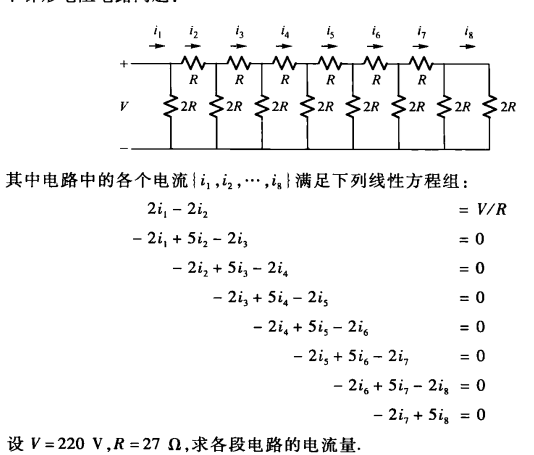
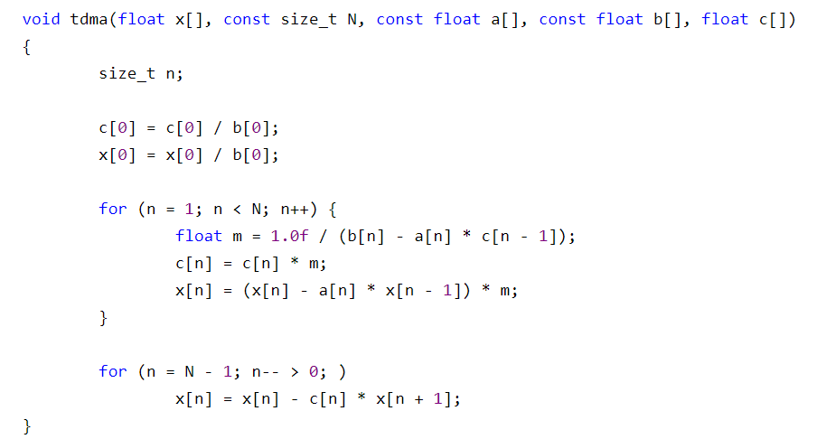

# 数 值 实 验 报 告

年级 2021级 班级 电车所研究生一班 姓名 郜佳雨

## 一、实验目的

2.2 编程实现追赶法求解三对角方程组的算法，并考虑如下梯形电阻电路问题

2.3 方程组的性态和矩阵条件数实验

## 二、实验内容步骤及结果

### 2.2

#### 2.2.1代码实现

```python
## 使用追赶法解三对角方程组
import numpy as np
a=[0,-2,-2,-2,-2,-2,-2,-2]
b=[2,5,5,5,5,5,5,5]
c=[-2,-2,-2,-2,-2,-2,-2]
d=[8.148,0,0,0,0,0,0,0]

for i in range(1,len(b)):
    a[i] = a[i]/b[i-1]   ## 计算l矩阵
    b[i] = b[i]-c[i-1]*a[i]   ## 计算u矩阵
    d[i] = d[i]-a[i]*d[i-1]   ## 计算y
d[-1] = d[-1]/b[-1]
for i in range(len(b)-2,-1,-1):
    d[i] = (d[i]-c[i]*d[i+1])/b[i]

print(d)
```

#### 2.2.2实验结果

电流 $I=\begin{pmatrix}8.15&4.07&2.04 &1.02 &0.51 &0.25& 0.12 &0.05\end{pmatrix}^T$

### 2.3

#### 2.3.1代码实现

```python
## 方程组的性态和矩阵条件数的实验

import numpy as np

def set_A_matrix(n,cho):
    A0 = np.empty((n,n))
    A1 = np.empty((n,n))
    for i in range(0,n):
        for j in range(0,n):
            A0[i,j]=(1+0.1*(i+1))**((j+1)-1)
            A1[i,j]=1/((i+j+2)-1)
    if cho == 0:
        return A0
    elif cho == 1:
        return A1

def set_B_matrix(n,A):
    B = np.empty(n)
    for i in range(0,n):
        sumA = 0
        for j in range(0,n):
            sumA = sumA + A[i][j]
        B[i] = sumA
    return B

for n in [5,10,20]:
    A0=set_A_matrix(n,0)
    B0=set_B_matrix(n,A0)
    cond_A0=np.linalg.cond(A0,2)
    X0=np.linalg.solve(A0,B0)
    print(X0)
    A1=set_A_matrix(n,1)
    B1=set_B_matrix(n,A1)
    cond_A1=np.linalg.cond(A1,2)
    X1=np.linalg.solve(A1,B1)
    print(X1)
```

#### 2.3.2实验结果

（1）求2-条件数判断是否病态
当$n=5$时：条件数$cond(A0)_2=536148.475041$  
当$n=5$时：条件数$cond(A1)_2=476607.250242$  
当$n=10$时：条件数$cond(A0)_2=868226210534.163452$  
当$n=10$时：条件数$cond(A1)_2=16024413500363.820312$  
当$n=20$时：条件数$cond(A0)_2=5516884134135433527296.000000$  
当$n=20$时：条件数$cond(A1)_2=1319397616634482176.000000$  
**结果**：所有系数矩阵都是病态的，且随着n的增大，病态程度不断增加  
（2）求方程组的解
当$n=5$时：方程组$A_0X=b$的解为：$(1,1,1,1,1)^T$  
当$n=5$时：方程组$A_1X=b$的解为：$(1,1,1,1,1)^T$  
当$n=10$时：方程组$A_0X=b$的解为：$(1,1,1,1,1,1,1,1,1,1)^T$  
当$n=10$时：方程组$A_1X=b$的解为：$(1,1,1,1,0.9999 ,1.0002 ,0.9997, 1.0003, 0.9998, 1 )^T$  
当$n=20$时：方程组$A_0X=b$的解为：$( 9.80567700e+02 ,-7.93444280e+03 , 2.91142485e+04 ,-6.32573218e+04,8.84592794e+04, -7.85146698e+04 , 3.44961816e+04 , 1.29635936e+04,-3.58380358e+04,3.23771765e+04, -1.83665797e+04 , 7.07264750e+03,-1.75285920e+03 , 1.89505200e+02 , 4.61136000e+01 ,-2.45338000e+01, 6.85370000e+00 , 2.18900000e-01 , 1.05930000e+00 , 9.98000000e-01)^T$  
当$n=20$时：方程组$A_1X=b$的解为：$(1,1.0001,  0.9959 ,  1.0766 ,  0.2341 ,  5.5365, -15.6104 , 38.1681,-43.8265 ,  9.8102,  51.4242 ,-55.2456  ,-6.0793,  55.0062 ,-38.7013,  15.7219,-9.2882,   9.179 ,  -1.4831 ,  1.0815)^T$  
**结果**：x1与精确解吻合，x2与精确解稍有差异，x3与精确解差别很大。可见随着n的增大，矩阵病态越来越严重。
（3）当n=10时，增加扰动项，观察解的变化
方程$A_0X=b$的解是$(0.9429,1.3352,0.1296,2.3111,-0.2627,1.8063 , 0.6585,1.0925 ,0.9855,1.001)^T$  
方程$A_1X=b$的解是$( 9.99100e-01 , 1.05180e+00 , 2.14900e-01 , 6.12660e+00 ,-1.63270e+01,3.34184e+01 ,-3.21640e+01 , 1.71344e+01 ,-4.63600e-01 , 9.00000e-03)^T$
**结果**：比较可见，系数矩阵出现微小变动，导致解出现较大变化。说明n=10时，系数矩阵是病态的。

## 三、实验结果分析

1. 对于2.2的问题，当满足$\parallel b_i\parallel > \parallel a_i\parallel + \parallel c_i\parallel$时，可以采用Tomas算法求解  

2. 实验结果表明当稀疏矩阵病态时，整个系统过于敏感，当对系数A矩阵进行微小扰动时，会对结果产生较大的影响。
3. 常见的可以使用SVD方法来求解系数矩阵病态的线性方程组
