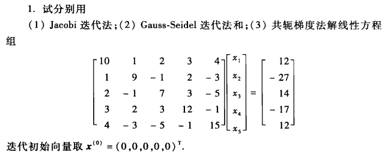
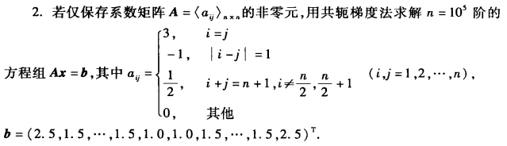

# 数值实验报告

## 一、实验目的

3.1  
  
3.2  


## 二、实验内容步骤及结果

`SolveLine.py`

```python
# _*_ coding: UTF-8 _*_
## 基本迭代法求解线性方程

import numpy as np

## 雅可比迭代
## 输入系数矩阵，值矩阵，最大迭代次数，精度
def Jacobi(A,b,x0,n,c):
    print('Jacobi')
    # 初始化起始向量x
    #x0=np.zeros(len(A))
    #x0=np.array([1,1,1,1])
    count = 1
    while count < n:
        nx=np.empty(len(A))
        for i in range(len(A)):
            temp=0
            for j in range(len(A)):
                if i != j:
                    temp += A[i][j]*x0[j]
            nx[i]=(b[i]-temp)/A[i][i]
        nc = np.linalg.norm(nx,np.inf)-np.linalg.norm(x0,np.inf)
        print("iteration:",count,"result:", np.around(nx,4),"error:",nc)
        if abs(nc) < c:
            return nx
        count += 1
        x0=nx
    print('达到最大迭代次数')
    return False

## 高斯赛德勒迭代
def GaussSeidel(A,b,x0,n,c):
    print('GaussSeidel')
    # 初始化起始向量x
    #x0=np.zeros(len(A))
    count = 1
    while count < n:
        nx=np.empty(len(A))
        for i in range(len(A)):
            temp=0
            tempx=x0.copy()
            for j in range(len(A)):
                if i != j:
                    temp += A[i][j]*x0[j]
            nx[i]=(b[i]-temp)/A[i][i]
            x0[i]=nx[i]
        nc = np.linalg.norm(nx)-np.linalg.norm(tempx)
        print("iteration:",count,"result:", np.around(nx,4),"error:",nc)
        if abs(nc) < c:
            return nx
        count += 1
        x0=nx
    print('Reaches the maximum number of iterations')
    return False   

## 松弛迭代法（SOR）
def SOR(A,b,x0,n,c,w):
    print('SOR')
    # 初始化起始向量x
    #x0=np.zeros(len(A))
    count = 1
    while count < n:
        nx=np.empty(len(A))
        for i in range(len(A)):
            temp=0
            tempx=x0.copy()
            for j in range(len(A)):
                if i != j:
                    temp += A[i][j]*x0[j]
            nx[i]=(1-w)*x0[i]+w*(b[i]-temp)/A[i][i]
            x0[i]=nx[i]
        nc = np.linalg.norm(nx)-np.linalg.norm(tempx)
        print("iteration:",count,"result:", np.around(nx,4),"error:",nc,w)
        if abs(nc) < c:
            return nx
        count += 1
    print('Reaches the maximum number of iterations')
    return False     

## 共轭梯度法
def ConjuateGradient(A,b,x,c):
    print('ConjuateGradient')
    x=np.zeros(len(A)) # 初始值x0
    r=b-np.dot(A,x)
    p=r  #p0=r0

    for i in range(len(A)):
        r1=r
        a=np.dot(r.T,r)/np.dot(p.T,np.dot(A,p))
        x = x + a * p    #x(k+1)=x(k)+a(k)*p(k)
        r=b-np.dot(A,x)  #r(k+1)=b-A*x(k+1)
        q = np.linalg.norm(np.dot(A, x) - b) / np.linalg.norm(b)
        print('iteration:', i,'result',x,'error',q)
        if q<c:
            break
        else:
            beta=np.linalg.norm(r)**2/np.linalg.norm(r1)**2
            p=r+beta*p  #p(k+1)=r(k+1)+beta(k)*p(k)
    return x

```

### 3.1

#### 3.1.1 代码实现

```python
import numpy as np
import SolveLine as sl

A=np.array([
[10.0,1.0,2.0,3.0,4.0],
[1.0,9.0,-1.0,2.0,-3.0],
[2.0,-1.0,7.0,3.0,-5.0],
[3.0,2.0,3.0,12.0,-1.0],
[4.0,-3.0,-5.0,-1.0,15.0]])
b=np.array([12.0,-27.0,14.0,-17.0,12.0])
x0=[0,0,0,0,0]

print('final result',sl.Jacobi(A,b,x0,100,0.0001))
print('final result',sl.GaussSeidel(A,b,x0,100,0.0001))
print('final result',sl.ConjuateGradient(A,b,x0,0.0001))
```

#### 3.1.2 实验结果

**Jacobi**
iteration: 1 result: [ 1.2    -3.      2.     -1.4167  0.8   ] error: 3.0
iteration: 2 result: [ 1.205  -2.3296  2.4071 -1.65    0.4522] error: -0.5928571428571425
iteration: 3 result: [ 1.2656 -2.349   2.3531 -1.8937  0.7051] error: -0.054074074074074385
iteration: 4 result: [ 1.2504 -2.2233  2.6181 -1.8711  0.6508] error: 0.265007369614513
iteration: 5 result: [ 1.1997 -2.2153  2.5919 -1.959   0.7699] error: -0.026190439797318277
iteration: 6 result: [ 1.1829 -2.1534  2.7302 -1.9312  0.7704] error: 0.13833529972865088
iteration: 7 result: [ 1.1405 -2.1421  2.7323 -1.9719  0.8352] error: 0.002106588533281606
iteration: 8 result: [ 1.1252 -2.1065  2.8098 -1.9583  0.8468] error: 0.07745896498220395
iteration: 9 result: [ 1.0975 -2.0954  2.8217 -1.9788  0.8847] error: 0.011867181590660358
iteration: 10 result: [ 1.085  -2.0738  2.8671 -1.9735  0.8969] error: 0.045396950608476594
iteration: 11 result: [ 1.0673 -2.0645  2.8802 -1.9843  0.92  ] error: 0.013120721769982246
iteration: 12 result: [ 1.0577 -2.0509  2.9077 -1.9828  0.9303] error: 0.027550849045836046
iteration: 13 result: [ 1.0463 -2.0437  2.9191 -1.9887  0.9448] error: 0.011332845246476708
iteration: 14 result: [ 1.0392 -2.035   2.9363 -1.9886  0.9527] error: 0.01720762906059692
iteration: 15 result: [ 1.0318 -2.0297  2.9451 -1.992   0.962 ] error: 0.008857629749328577
iteration: 16 result: [ 1.0267 -2.0241  2.9561 -1.9924  0.9678] error: 0.011001067409395215
iteration: 17 result: [ 1.0218 -2.0203  2.9627 -1.9944  0.9739] error: 0.006576245609630771
iteration: 18 result: [ 1.0182 -2.0165  2.9699 -1.9949  0.9781] error: 0.007162815623968921
iteration: 19 result: [ 1.0149 -2.0138  2.9746 -1.9961  0.9821] error: 0.0047400286712813156
iteration: 20 result: [ 1.0124 -2.0113  2.9793 -1.9966  0.9851] error: 0.004728715420385221
iteration: 21 result: [ 1.0102 -2.0094  2.9827 -1.9973  0.9878] error: 0.003354974124590626
iteration: 22 result: [ 1.0085 -2.0077  2.9858 -1.9977  0.9898] error: 0.0031537895977415964
iteration: 23 result: [ 1.007  -2.0064  2.9882 -1.9981  0.9916] error: 0.0023472484625473022
iteration: 24 result: [ 1.0058 -2.0053  2.9903 -1.9984  0.993 ] error: 0.0021189516260271546
iteration: 25 result: [ 1.0048 -2.0044  2.9919 -1.9987  0.9943] error: 0.001629798850595332
iteration: 26 result: [ 1.004  -2.0036  2.9934 -1.9989  0.9952] error: 0.0014311482232223227
iteration: 27 result: [ 1.0033 -2.003   2.9945 -1.9991  0.9961] error: 0.0011259512904451263
iteration: 28 result: [ 1.0027 -2.0025  2.9955 -1.9993  0.9967] error: 0.000970173115069084
iteration: 29 result: [ 1.0022 -2.0021  2.9962 -1.9994  0.9973] error: 0.0007752380497003664
iteration: 30 result: [ 1.0019 -2.0017  2.9969 -1.9995  0.9978] error: 0.0006593742185168061
iteration: 31 result: [ 1.0015 -2.0014  2.9974 -1.9996  0.9982] error: 0.0005325451191384722
iteration: 32 result: [ 1.0013 -2.0012  2.9979 -1.9997  0.9985] error: 0.00044894319653199233
iteration: 33 result: [ 1.001  -2.001   2.9982 -1.9997  0.9987] error: 0.00036526011311810436
iteration: 34 result: [ 1.0009 -2.0008  2.9985 -1.9998  0.999 ] error: 0.00030604718148685706
iteration: 35 result: [ 1.0007 -2.0007  2.9988 -1.9998  0.9991] error: 0.00025025780778520357
iteration: 36 result: [ 1.0006 -2.0005  2.999  -1.9998  0.9993] error: 0.00020881248729276436
iteration: 37 result: [ 1.0005 -2.0004  2.9992 -1.9999  0.9994] error: 0.00017133987963058317
iteration: 38 result: [ 1.0004 -2.0004  2.9993 -1.9999  0.9995] error: 0.00014255428394038816
iteration: 39 result: [ 1.0003 -2.0003  2.9994 -1.9999  0.9996] error: 0.00011725032543408176
iteration: 40 result: [ 1.0003 -2.0003  2.9995 -1.9999  0.9997] error: 9.735989282200208e-05
**final result [ 1.00027607 -2.00025293  2.99953626 -1.99992557  0.99966874]**

**GaussSeidel**
iteration: 1 result: [ 1.2    -3.1333  1.2095 -1.4968  0.1567] error: 0.0031736204616588104
iteration: 2 result: [ 1.6578 -2.6649  1.8991 -1.8487  0.3347] error: 0.010625842033760158
iteration: 3 result: [ 1.5074 -2.4341  2.253  -1.9232  0.534 ] error: 0.02088784196322635
iteration: 4 result: [ 1.3562 -2.295   2.4903 -1.9513  0.6794] error: 0.021091124451528387
iteration: 5 result: [ 1.2451 -2.2016  2.6513 -1.9672  0.7803] error: 0.017440627787286722
iteration: 6 result: [ 1.168  -2.1379  2.7613 -1.9776  0.8496] error: 0.013256269656723774
iteration: 7 result: [ 1.115  -2.0944  2.8366 -1.9847  0.897 ] error: 0.009666096267073598
iteration: 8 result: [ 1.0787 -2.0646  2.8882 -1.9895  0.9295] error: 0.0068867401752026325
iteration: 9 result: [ 1.0539 -2.0442  2.9234 -1.9928  0.9517] error: 0.0048385801306718434
iteration: 10 result: [ 1.0369 -2.0303  2.9476 -1.9951  0.967 ] error: 0.0033698183090953293
iteration: 11 result: [ 1.0253 -2.0207  2.9641 -1.9966  0.9774] error: 0.0023335827822865696
iteration: 12 result: [ 1.0173 -2.0142  2.9754 -1.9977  0.9845] error: 0.0016099391652382167
iteration: 13 result: [ 1.0118 -2.0097  2.9832 -1.9984  0.9894] error: 0.0011079172014163419
iteration: 14 result: [ 1.0081 -2.0067  2.9885 -1.9989  0.9927] error: 0.0007611543425802836
iteration: 15 result: [ 1.0055 -2.0046  2.9921 -1.9993  0.995 ] error: 0.0005223271617218472
iteration: 16 result: [ 1.0038 -2.0031  2.9946 -1.9995  0.9966] error: 0.0003581590821060132
iteration: 17 result: [ 1.0026 -2.0021  2.9963 -1.9997  0.9977] error: 0.0002454597092613753
iteration: 18 result: [ 1.0018 -2.0015  2.9975 -1.9998  0.9984] error: 0.0001681621338853745
iteration: 19 result: [ 1.0012 -2.001   2.9983 -1.9998  0.9989] error: 0.00011517799489624281
iteration: 20 result: [ 1.0008 -2.0007  2.9988 -1.9999  0.9993] error: 7.887473449308402e-05
**final result [ 1.00083379 -2.0006845   2.99881544 -1.99988913  0.9992533 ]**

**ConjuateGradient**
iteration: 0 result [ 1.07356007 -2.41551016  1.25248675 -1.52087676  1.07356007] error 0.3953327039767577
iteration: 1 result [ 1.30560481 -2.62798056  2.14663622 -1.69427042  0.44239319] error 0.08048552331235245
iteration: 2 result [ 1.44661808 -2.22538362  2.44804837 -1.97069065  0.62072181] error 0.050100508350973
iteration: 3 result [ 1.08655012 -2.06357384  2.79291064 -2.10164499  0.83638627] error 0.05037799653157019
iteration: 4 result [ 1. -2.  3. -2.  1.] error 4.25054356511454e-16
**final result [ 1. -2.  3. -2.  1.]**

### 3.2

#### 3.2.1 代码实现

```python
import numpy as np
import SolveLine as sl

n=int(10e3)
A=np.empty([n,n])
for i in range(0,n):    
    for j in range(0,n):
        A[i][j]=0
        if i==j:
            A[i][j]=2.0
        elif abs(i-j)==1:
            A[i][j]=-1.0
        elif (i+j==n-1)and(i != (n-1)/2)and(i != ((n-1)/2)+1):
            A[i][j]=0.5
        else:
            A[i][j]=0.0

b=np.empty(n)
for i in range(0,n):
    if i==0 or i==n-1:
        b[i]=2.5
    elif i==int((n-1)/2) or i==int((n-1)/2)+1:
        b[i]=1.0
    else:
        b[i]=1.5
x0=np.zeros(n)
print(A)
print(b)
print('final result',sl.ConjuateGradient(A,b,x0,0.0001))
```

#### 3.2.2 实验结果

系数矩阵A:  
$$
\left[
 \begin{matrix}
   2 & -1 & 0 & \cdots & 0 & 0 & 0.5\\
   -1 & 2 & -1 & \cdots & 0 & 0.5 &0 \\
   0 & -1 & 2 & \cdots &0.5 & 0 &0 \\
   \cdots\\
   0&0&0.5&\cdots&2&-1&0\\
   0&0.5&0&\cdots&-1&2&-1\\
   0.5&0&0&\cdots&0&-1&2
  \end{matrix}
\right]
$$
值矩阵b：  
$$
\left[
\begin{matrix}
2.5&1.5&1.5&\cdots&1.5&1.5&2.5
\end{matrix}
\right]
$$
计算结果：  
ConjuateGradient
iteration: 0 result [4.99378703 2.99627222 2.99627222 ... 2.99627222 2.99627222 4.99378703] error 0.07169344556517201
iteration: 1 result [2.62540454 3.67775152 2.99952287 ... 2.99952287 3.67775152 2.62540454] error 0.023566007787797678
iteration: 2 result [2.06559828 2.767563   3.33336585 ... 3.33336585 2.767563   2.06559828] error 0.01304061814512154
iteration: 3 result [1.91176212 2.39934988 2.79560395 ... 2.79560395 2.39934988 1.91176212] error 0.009209763853784438
iteration: 4 result [1.91015693 2.34378538 2.59154015 ... 2.59154015 2.34378538 1.91015693] error 0.006507590440057726
iteration: 5 result [1.95061937 2.40421921 2.62099957 ... 2.62099957 2.40421921 1.95061937] error 0.004021492561102083
iteration: 6 result [1.97967853 2.45837947 2.68708676 ... 2.68708676 2.45837947 1.97967853] error 0.002210977910203453
iteration: 7 result [1.99275433 2.48466274 2.72528223 ... 2.72528223 2.48466274 1.99275433] error 0.001145937945222567
iteration: 8 result [1.99759727 2.49480102 2.74127437 ... 2.74127437 2.49480102 1.99759727] error 0.000580220616185882
iteration: 9 result [1.99923486 2.49831848 2.74709865 ... 2.74709865 2.49831848 1.99923486] error 0.0002913450296466077
iteration: 10 result [1.99976248 2.49947202 2.74907075 ... 2.74907075 2.49947202 1.99976248] error 0.00014587787364389498
iteration: 11 result [1.99992757 2.49983759 2.7497099  ... 2.7497099  2.49983759 1.99992757] error 7.297267478231504e-05
**final result [1.99992757 2.49983759 2.7497099  ... 2.7497099  2.49983759 1.99992757]**

## 三、实验结果分析

目前算法缺少对于收敛性的判断，其中 Jacobi 和 G-S 法收敛必须要满足系数矩阵为严格对角占优或者不可约弱对角占优矩阵；共轭梯度法优点是存储量小，计算方便。但是当方程组条件数大的时候，这些方法收敛速度都很慢。之后的算法改进需要添加对迭代法收敛性的判断条件，且需要对输入的矩阵进行判断，判断方程是否有解以及输入矩阵格式是否正确。
